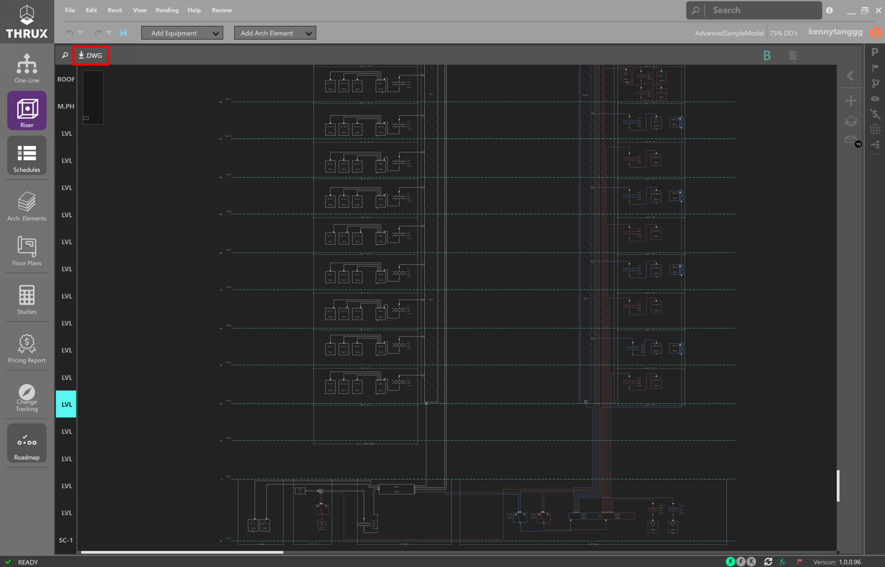
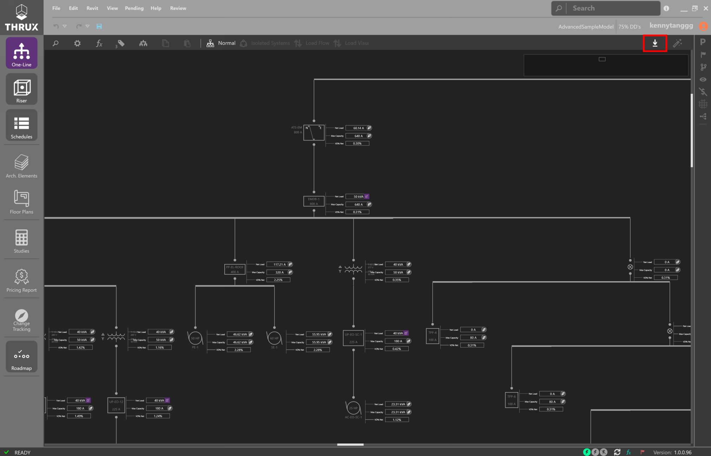
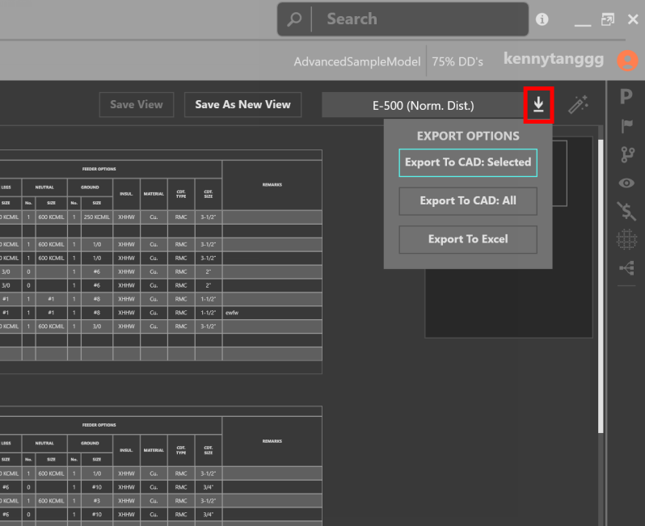
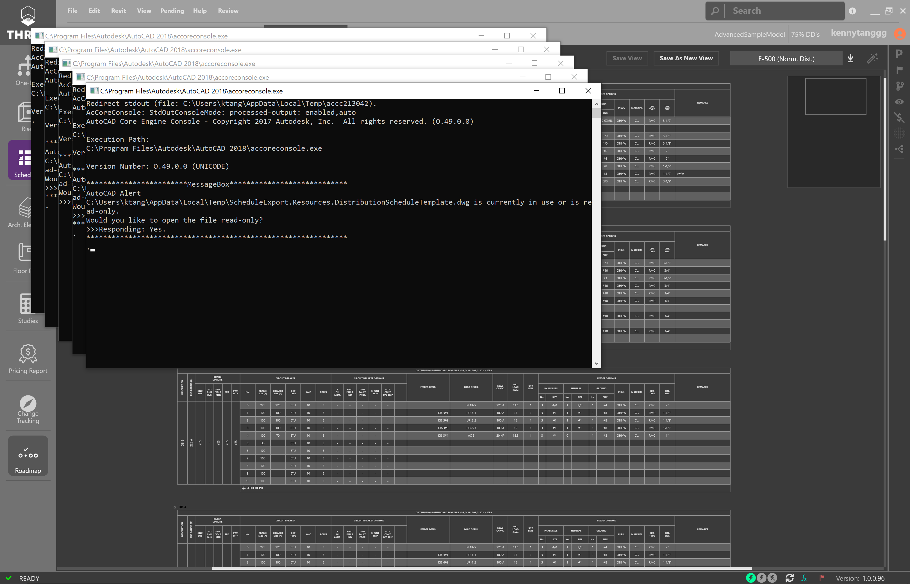
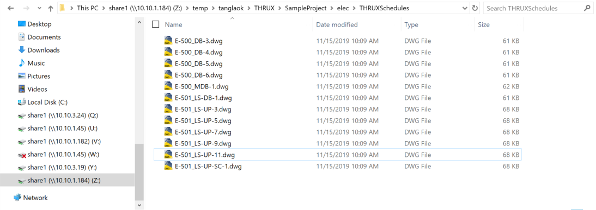

THRUX Implementation Guide
==========================

This guide is aimed to help designers manage their workflows throughout the design lifecycles of their projects.  And it will also show examples of how to turn their THRUX models into deliverable documents.

We will cover Branches, Issuances, and exporting your designs to AutoCAD or Excel.

Branching
---------

What is a Branch?

What are common ways to use Branches?

Preparing Drawings
------------------

Once your design is reviewed and ready to be issued, the next step is to export your design.  

The goal is to get a THRUX model into a drafting environment like AutoCAD or Revit to produce a deliverable to Contractors.

The Riser, One-Line, and Schedules are exportable to AutoCAD.

Schedules are also exportable to Excel.

The Studies are flexible reports which can be printed in PDF format.

Once you have built a THRUX model, export the documents you need as necessary.  The following information is exportable:
  * Riser
  * One-Line
  * Schedules
  * Studies
  * Pricing Report

Riser
^^^^^

Export the Riser to AutoCAD by clicking on the down arrow.

One-Line
^^^^^^^^

Export the One-Line to AutoCAD by clicking on the down arrow.

Schedules and Schedule Views
^^^^^^^^^^^^^^^^^^^^^^^^^^^^

Schedule Views are groupings of electrical Schedules.  For example, designers may group their Schedules by size or by priority.  In other words, the main or larger panels are grouped together, and the utility or emergency panels are placed in another group.

It is possible to export all of your Schedules at the same time, however, that operation may take longer and it may be more beneficial to export Schedules in smaller groups.

These Views can be viewed at any time. 

.. figure:: images/ScheduleSetup-0.PNG
    :align: center

    Saving a group of Schedules as a Schedule View

After you create your Views, you can export your Schedules to AutoCAD.  

Click on the down arrow and then click "Export To AutoCAD: Selected."

    Saving a group of Schedules as E-500

Name the file with the same name as your Schedule .

* FileName_Equipment_Name.dwg

You should see multiple instances of AcCoreConsole (Command Prompt) opening on your screen.  This will create multiple AutoCAD files in your directory.

    Exporting Schedules to AutoCAD

We've created a folder which holds all of our THRUX exports.

    THRUX Schedules

In AutoCAD, now we can set up a single drawing which XREFs our THRUX Schedules.  When the design changes, we can export our schedules, and our drawings will update.

